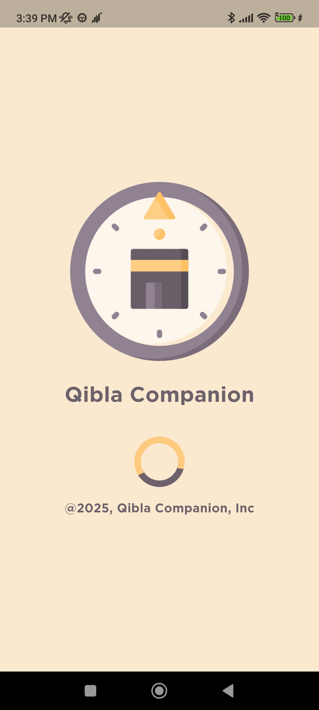
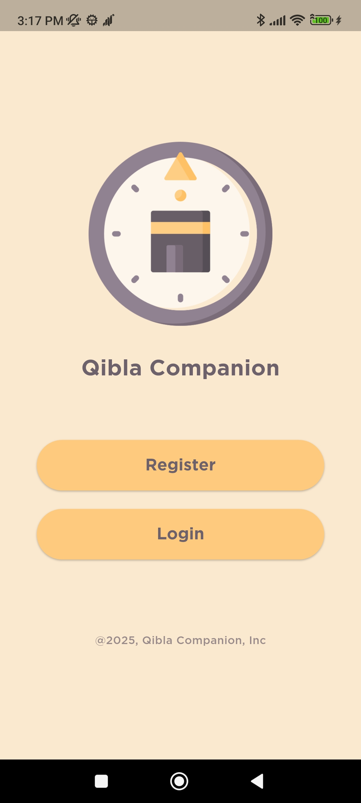
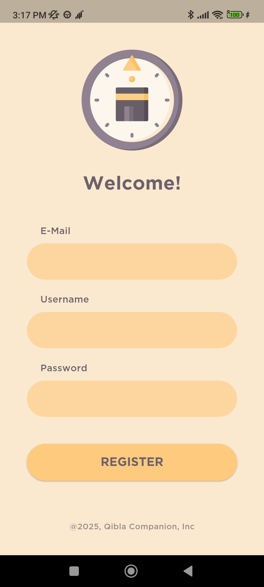
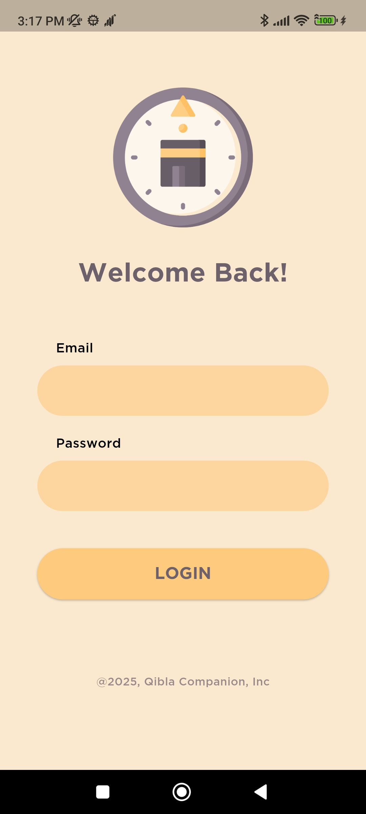
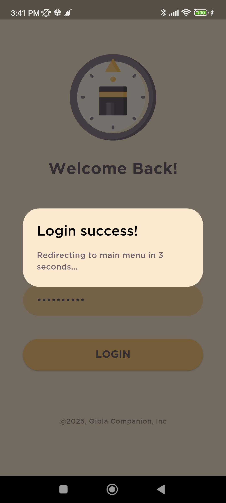
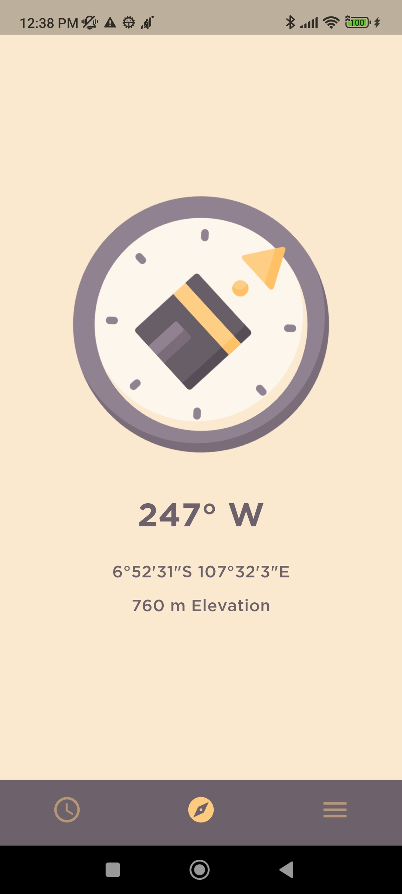
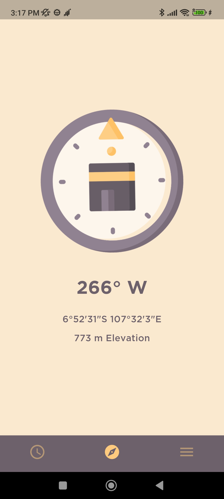
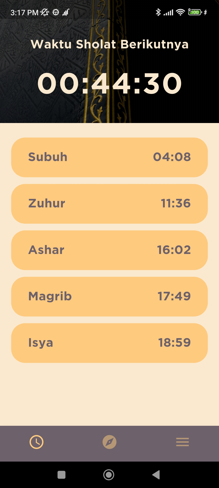
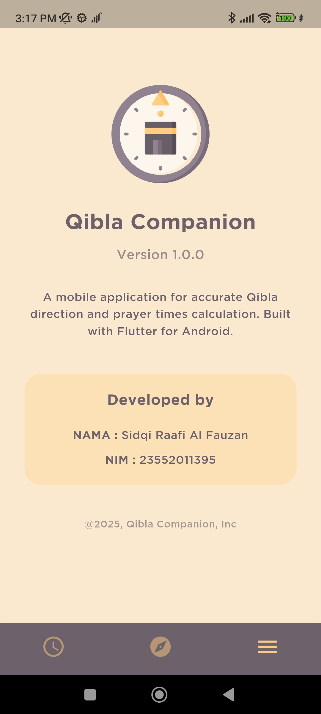

# Qibla Companion
[](https://flutter.dev/)
[](https://dart.dev/)
[](https://github.com/SidqiRaafi/qibla-companion)
[](LICENSE)
[](https://github.com/SidqiRaafi/qibla-companion/graphs/commit-activity)

A modern Flutter app providing Qibla direction and prayer times for Muslims.  
🕌 Built with [Flutter](https://flutter.dev/) · 📦 Integrates Firebase Auth & Firestore · 📍 Uses geolocation & compass

---

## 🚀 Features

- **Realtime Qibla Direction** – Accurate using your device’s sensors
- **Prayer Times Calculation** – Powered by [Adhan Dart](https://pub.dev/packages/adhan_dart)
- **Authentication** – Email/password sign-up & login with Firebase
- **User Profiles** – Securely stored in Firestore per user
- **Beautiful UI** – Custom splash, responsive layout, themed colors
- **Works Offline** – Basic Qibla always available

---
## 📸 Screenshots & Demo

<p align="center">
  
  
  
  
  
  
  
  
  
  
</p>

<p align="center">
  <video src="assets/github_demo/11_video_demo.mp4" width="360" controls></video>
</p>

---


## 🛠️ Getting Started

### Prerequisites

- [Flutter SDK](https://flutter.dev/docs/get-started/install) (>= 3.9.2)
- A configured Firebase project (see below)

### 1. Clone the repo
```
git clone https://github.com/SidqiRaafi/qibla-companion.git
```
```
cd qibla-companion
```

### 2. Install dependencies
```
flutter pub get
```

### 3. Firebase Setup

- Download your `google-services.json` and/or `GoogleService-Info.plist`
- Add required Firebase configs.
- Generate `firebase_options.dart` using [`flutterfire configure`](https://firebase.flutter.dev/docs/cli/)

### 4. Run the app
```
flutter run
```
---

## 🤝 Contributing

Pull requests and suggestions are always welcome!  
1. Fork the repo
2. Create your feature branch (`git checkout -b feature/foo`)
3. Commit your changes (`git commit -am 'Add feature'`)
4. Push to the branch (`git push origin feature/foo`)
5. Open a [Pull Request](https://github.com/SidqiRaafi/qibla-companion/pulls)

---

## 🙏 Credits

- [SidqiRaafi](https://github.com/SidqiRaafi)
- Flutter, Firebase, Adhan Dart, flutter qiblah, geolocator & open source creators

---


